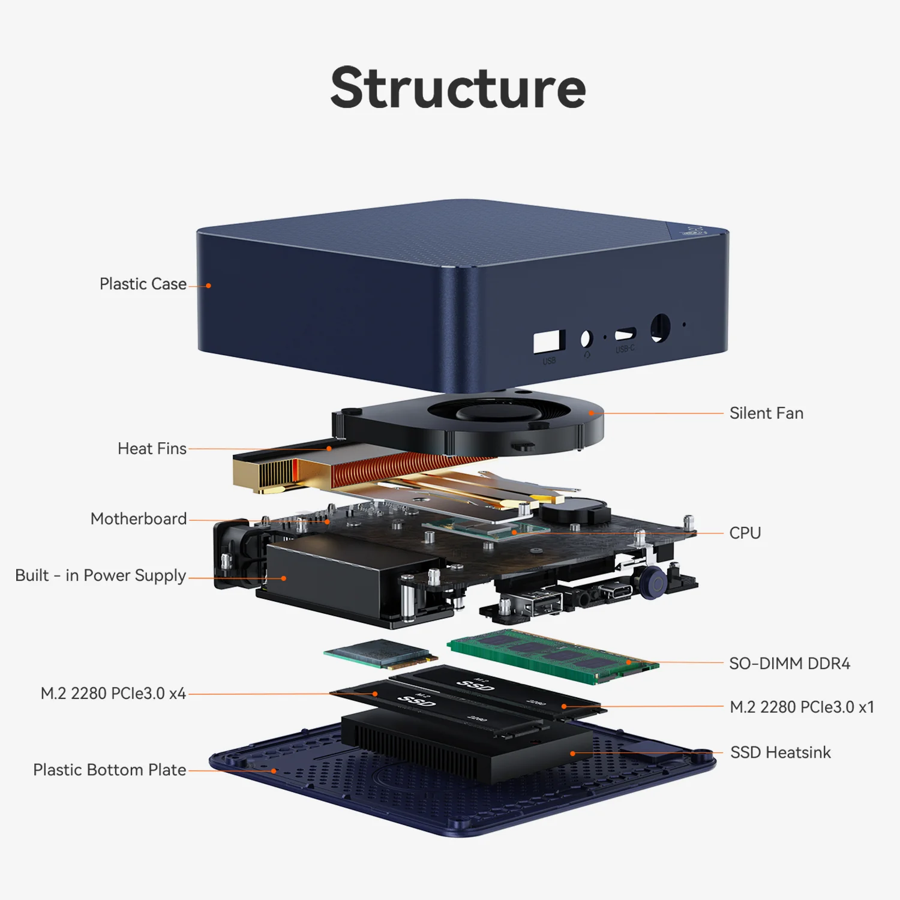

# Beehive Server
This repository provides a declarative NixOS configuration with a custom ISO and install script to quickly set up and reproduce my homelab server environment.

> [!NOTE]
> This config is inspired by [chenglab](https://github.com/eh8/chenglab)

<p align="center">
  
  <br>
  Beelink EQ14 - Intel Twin Lake N150 - 16GB RAM DDR4 - 2.5 GBit/s
  <br>
  <br>
</p>


[](https://en.wikipedia.org/wiki/Poul-Henning_Kamp#Beerware)
[](https://nixos.org)


## Functionality

> [!NOTE]
> The reason for this modular approach is that in the future, multiple servers can be configured without redundancy. Only the flake would need to be adjusted to provide different variables.

- ❄️ Nix flakes handle upstream dependencies and track latest stable release of Nixpkgs
- 🤫 [sops-nix](https://github.com/Mic92/sops-nix) manages secrets
- 🍃 [impermanence](https://github.com/nix-community/impermanence) keeps the system clean
- 🔑 Remote initrd unlock system to decrypt drives on boot (ZFS encryption)
- 🔄 Swap uses random encryption
- 🔐 UEFI secure boot with [lanzaboot](https://github.com/nix-community/lanzaboote) (_not working right now_)
- 🤖 `flake.lock` updated daily via GitHub Action and the server upgrades automatically once a month
- 📦 [Custom ISO](https://github.com/david-schor/beehive-server/releases) for fast install
- ☸️ k3s fully declarative to run services
- 🧱 Modular architecture increases maintainability and is future-oriented

## Getting started
> [!WARNING]
> This script is primarily meant for my own use.

### Personal SSH and Age
> [!IMPORTANT]
> Make sure to keep those secure as possible.
First of all its important to create an ed25519 ssh key and based on that generate a age key for sops with [ssh-to-age](https://github.com/Mic92/ssh-to-age). 
```bash
ssh-keygen -t ed25519 -C "<email or description>"
```
ssh-to-age:
```bash
ssh-to-age -private-key -i $HOME/.ssh/id_ed25519 -o key.txt
# OR (if you set a passphrase)
read -s SSH_TO_AGE_PASSPHRASE; export SSH_TO_AGE_PASSPHRASE
ssh-to-age -private-key -i $HOME/.ssh/id_ed25519 -o key.txt

cat key.txt
```
The output of `key.txt` must be set in `.sops.yaml`. It's used to encrypt your credentials.

### Installation 
Use the [Custom ISO](https://github.com/david-schor/beehive-server/releases) and flash it on a usb-stick and boot from it. It's important to note, that you have to deactivate secure boot first.
After you ssh'd into nixos e.g your server, run following cmd:
```bash
sudo bash -c "$(curl -fsSL https://raw.githubusercontent.com/david-schor/beehive-server/main/install.sh)"
```
After the setup copy the vars into `vars.nix` (maybe you also have to change some vars) and also add the age key to `.sops.yaml`.
Before you commit and push the changes run follwoing cmd to encrypt your credentials:
```bash
sops -e -i secrets/secrets.yaml
```
Now you can install the server configs:
```bash
sudo nixos-install \
  --no-root-passwd \
  --root /mnt \
  --flake github:david-schor/beehive-server#beeserver \
  --option substituters "https://cache.nixos.org https://beehiveserver.cachix.org" \
  --option trusted-public-keys "cache.nixos.org-1:6NCHdD59X431o0gWypbMrAURkbJ16ZPMQFGspcDShjY= beehiveserver.cachix.org-1:ZzReqkFfK1Dc+Qfrfj79EnyqiLTw5N13r/4r18aZ51c="
```
Finally you can reboot and boot into UEFI directly to enable secure boot and also set a UEFI password.

### Decrypt on boot
To decrypt the drives you have to ssh into the server like this:
```bash
ssh -i .\id_ed25519 root@192.168.40.2 -p 2222
```